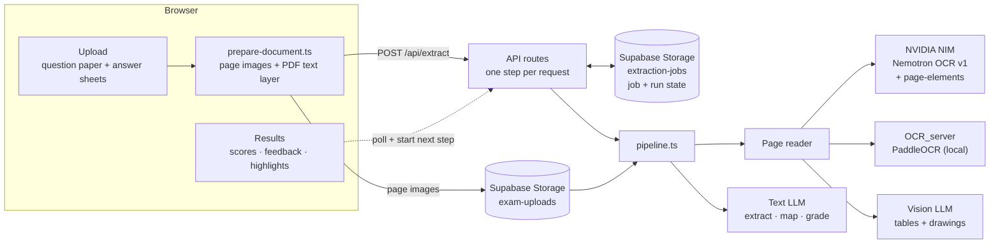
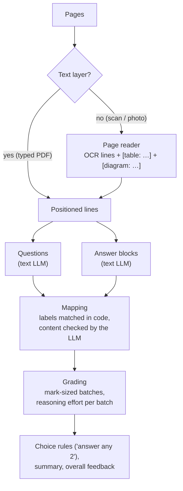
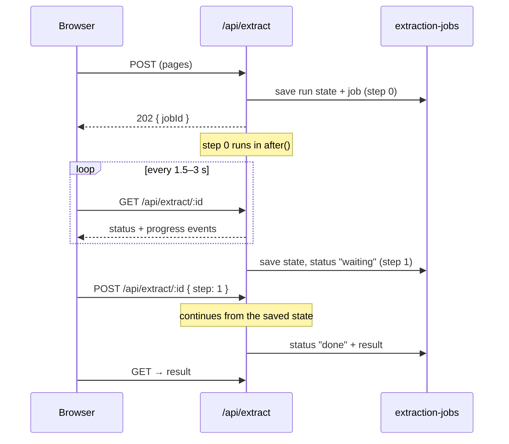

# VedaAI: exam extraction and grading

Upload a question paper and a student's answer sheets (typed PDFs, scans or
phone photos). VedaAI works out which answer belongs to which question,
grades each answer with feedback, and highlights it on the sheet.

**Stack:** Next.js 16 · React 19 · Tailwind v4 · AI SDK v7 · Supabase Storage ·
pdf.js · NVIDIA NIM / PaddleOCR

**Test paper (OS_15):** 7 scanned pages, 38 questions, 59.5/70, 280 s end to end.

---

## Architecture



**In the browser:**
- PDFs become page images with pdf.js. Typed PDFs keep their text layer, so they need no OCR.
- The teacher sets the page order by dragging. This uses pointer events, since
  HTML5 drag-and-drop doesn't work on touch screens.

### The pipeline



**The models never produce coordinates.** Every line has an id and a box. The
LLM refers only to line ids, and the highlight is the union of those lines'
boxes:

```
[p2-l14] 3 (b) User level threads are managed by a library ...
LLM → { "studentLabel": "3b", "firstLineId": "p2-l14", "lastLineId": "p2-l21" }
```

Malformed JSON from the model (once, a single missing `]` sank a 4.8-minute
call) is fixed with `jsonrepair` before any retry.

### Reading scanned pages

```
OCR (Nemotron OCR v1 or PaddleOCR)  →  line text + boxes
page-elements (NVIDIA)              →  where the tables are
Vision LLM                          →  finds drawings, describes each in a sentence for the grader
```

Eight readers were compared in a (since removed) `/ocr` lab: a vision LLM alone,
HunyuanOCR, a Hunyuan + LLM hybrid, PaddleOCR, PaddleOCR + LLM, Mistral OCR,
Nemotron OCR v1 and v2, and Qwen via Groq.
- **What worked best:** OCR engines give precise boxes but don't understand
  tables or drawings, so the OCR is paired with a vision LLM. The two best
  combinations are kept: `nemotron-v1` (hosted, the default) and `paddle-llm`
  (local).
- **False tables:** the vision LLM saw tables that weren't there. Now
  `page-elements` (*nemoretriever-page-elements-v3*) confirms each table, and
  its rows are rebuilt from the OCR's cell boxes.
- **Preprocessing** (contrast ×1.3, brightness +15) is opt-in
  (`AI_OCR_ENHANCE`). It made no difference on clean scans.

### Mapping answers to questions

Students mislabel answers, for example writing "3b" twice when the second one
is really 3(c). Matching therefore works in two passes:
1. **Code** (`label-match.ts`) matches clear labels and flags doubtful ones
   (duplicates, labels that match no question).
2. **The LLM** checks every answer's content against its match and returns
   only the corrections.

On the test paper it caught 3(a)→3(b) and 3(b)→3(c).

### Grading

Grading the whole paper in one call took 4.8 minutes and ~20k reasoning
tokens. Batches are now planned in code, with no LLM involved:
- **Batch count:** `ceil(total marks / MARKS_PER_BATCH)` (`grading-batches.ts`).
- **Grouping:** a dynamic-programming split keeps small-mark questions
  together, so heavy reasoning goes only to the high-mark or complex batches.
- **Unanswered questions** count as 1 mark. They still get feedback on what a
  good answer contains.
- **Reasoning effort** (`reasoning.ts`) rises with a batch's marks, and goes one
  level higher for long answers or "prove / derive / design" questions.
- **Failures:** batches run 3 at a time, and a failed batch is flagged for review
  instead of failing the run.

### Runs in steps (fits a 300 s request)

Vercel Hobby stops a function at 300 s, and a run takes several minutes. The
first two attempts didn't fit:
- one long streamed request;
- `after()` with polling, which was still a single invocation needing 800 s on
  Vercel Pro.

So the pipeline became a **resumable state machine**. A run is made of
**units**: a page, the extraction, the mapping, one grading batch, and the
overall feedback.
- A request starts units only while they should finish before **270 s**.
- It then saves the state as JSON, and the page starts the next step.
- Work still running at **285 s** is stopped and redone in the next step.
- Two steps in a row with no finished unit fail the run with a clear message.

The test paper takes 2 steps: ~204 s (reading, extraction, mapping) and ~70 s
(grading).



---

## Getting started

```bash
npm install
cp .env.example .env.local   # fill in the keys
npm run dev                  # http://localhost:3001
```

1. **Supabase:** run `supabase/migrations/*.sql` once. The `extraction-jobs`
   bucket is created on first use.
2. **Keys:** `DEEPSEEK_API_KEY` (or another provider), `NVIDIA_API_KEY`, and the
   Supabase URL and keys.
3. **Optional:** a PaddleOCR server for `paddle-llm`:
   `python OCR_server/ocr_server.py start` ([details](OCR_server/README.md)).

| Variable | What it does | Default |
|---|---|---|
| `AI_MODEL` | Text model (`provider:model`) | `deepseek:deepseek-v4-flash` |
| `AI_VISION_MODEL` | Tables and drawings on scans | `deepseek:deepseek-v4-flash-vision-exp` |
| `AI_OCR_ENGINE` | `nemotron-v1` or `paddle-llm` | `nemotron-v1` |
| `AI_REASONING` | `auto` (scales with marks) or `off` | `auto` |
| `AI_OCR_ENHANCE` | Contrast and brightness boost for dim photos | `off` |

Providers: `deepseek`, `openai`, `anthropic`, `google`, `openrouter`, `groq`,
`gateway`, `compatible` (any OpenAI-compatible API).

```
src/lib/extraction/  pipeline.ts (state machine), steps.ts, jobs.ts, label-match.ts, grading-batches.ts
src/lib/ocr/         readers.ts, nemotron.ts, paddle.ts, structure.ts (tables + drawings)
src/lib/ai/          models.ts, reasoning.ts, vision-settings.ts
src/components/      extraction/ (upload → loading → results), shell/
OCR_server/          PaddleOCR server (Python, CPU)
```

## Known limits

- **Keep the tab open.** The page drives the steps, so closing it stops the
  run after the current step.
- **Very slow calls fail the run.** A single model call over ~285 s, twice in
  a row, ends the run.
