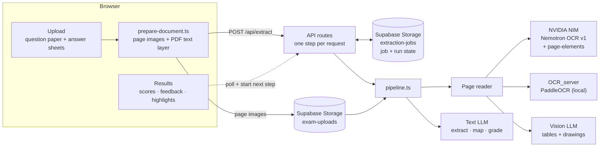
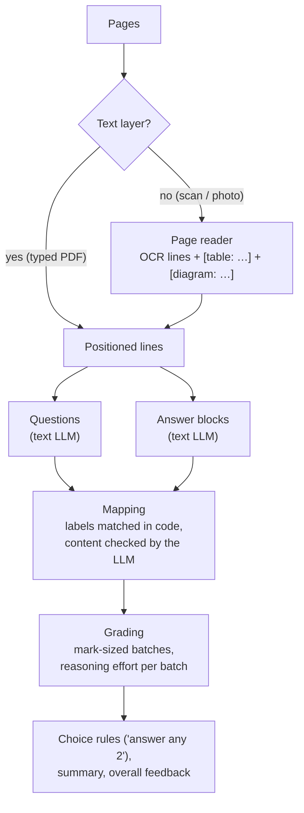
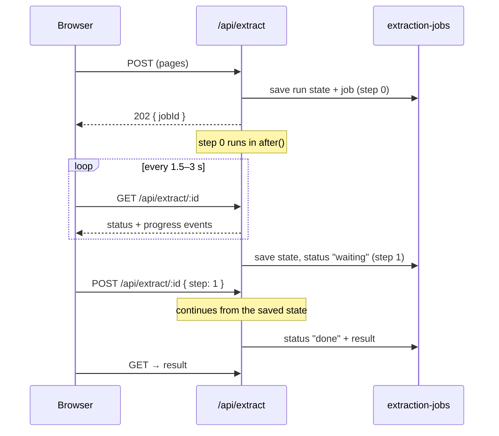

# VedaAI: exam extraction and grading

Upload a question paper and a student's answer sheets (typed PDFs, scans or
phone photos). VedaAI reads both, works out which answer belongs to which
question, grades every answer with feedback, and highlights each answer on
the sheet.

**Stack:** Next.js 16 (App Router) · React 19 · Tailwind v4 · AI SDK v7 ·
Supabase Storage · pdf.js · NVIDIA NIM / PaddleOCR for handwriting

**On the test paper (OS_15):** 7 scanned pages, 38 questions, 59.5/70, 280 s
end to end.

---

## Architecture



### In the browser

PDFs are turned into page images with pdf.js. A typed PDF also gives its text
layer, with exact line positions, so it never needs OCR. Scans and photos are
uploaded as images.

With several answer sheets, the teacher sets the page order by dragging. HTML5
drag-and-drop doesn't fire on touch screens, so it uses pointer events: drag
by the grip on a phone (so the list still scrolls), drag the whole row with a
mouse, or use the arrows.

### The pipeline



**The models never produce coordinates.** Every line gets an id and a box,
from the PDF text layer or the OCR. The LLM only refers to line ids, and the
highlight is the union of those lines' boxes:

```
[p2-l14] 3 (b) User level threads are managed by a library ...
[p2-l15] ...
LLM → { "studentLabel": "3b", "firstLineId": "p2-l14", "lastLineId": "p2-l21" }
```

**Text model.** DeepSeek V4 Flash found all 38 questions on the test paper.
NVIDIA-hosted text models were tried too: DeepSeek V4.1 Flash on NIM kept
timing out, and Nemotron text models were slow and found only 32 (they missed
Q8). Any provider can be plugged in through `AI_MODEL`.

**Broken JSON is repaired, not retried.** Once, a 4.8-minute grading call
failed because the model left out a single `]`. Malformed replies now go
through `jsonrepair` and are checked against the schema. A full retry happens
only if the repair fails.

### Reading scanned pages

A page reader turns a scan into positioned lines, plus one `[table: …]` line per
table and one `[diagram: …]` line per drawing:

```
OCR (Nemotron OCR v1 or PaddleOCR)  →  line text + boxes
NVIDIA page-elements                →  where the tables are
Vision LLM                          →  finds and describes drawings
```

Eight readers were compared side by side in a (since removed) `/ocr` lab:
- a vision LLM alone;
- HunyuanOCR (local, llama.cpp), and a Hunyuan + LLM hybrid;
- PaddleOCR, and PaddleOCR + LLM;
- Mistral OCR;
- Nemotron OCR v1 and v2;
- Qwen via Groq.

OCR engines give precise line boxes but don't understand tables or drawings.
The fix was to pair the OCR with a vision LLM that only handles the drawings.
The two best combinations are kept: `nemotron-v1` (hosted, the default) and
`paddle-llm` (local server). The other engines are archived locally in
`old_ocr/`, which is git-ignored.

- **False tables.** The vision LLM saw tables that weren't there and drew
  overlapping ones. Now page-elements confirms each table, and its rows are
  rebuilt from the OCR's own cell boxes rather than guessed by the LLM.
- **Drawings are checked on every scanned page.** Using page-elements to skip
  pages without drawings was tested. It flagged 0 of the hand-drawn diagrams in
  3 runs, so the vision LLM still looks at every scanned page.
- **Preprocessing is opt-in.** A contrast and brightness boost (×1.3, +15) made
  no difference on clean scans. It stays available for dim phone photos
  (`AI_OCR_ENHANCE`).

### Mapping answers to questions

Students write their own labels, and they get them wrong. For example, a
student may write "3b" twice when the second answer is really 3(c). So matching
is done in two passes:

1. **In code (`label-match.ts`).** Clear labels are matched directly: "Q2",
   "3 (b)", "8 b ii", and bare "(ii)" read against the labels around it.
   Doubtful ones are flagged: duplicate labels, and labels that match no
   question.
2. **By the LLM.** It reads every block against the proposed match, corrects
   wrong labels by their content, and returns only the changes. If this call
   fails, the matches from the labels are used.

On the test paper it caught 3(a)→3(b) and 3(b)→3(c), and narrowed an "8(b)"
heading down to the parts actually answered.

### Grading

Grading the whole paper in one call spent ~20k reasoning tokens and took 4.8
minutes. Grading is now split into batches, planned in code without an LLM:

- **How many batches:** `ceil(total marks / MARKS_PER_BATCH)`
  (`grading-batches.ts`).
- **How they're grouped:** a dynamic-programming split keeps small-mark
  questions together and gives big questions batches of their own.
- **Unanswered questions** count as 1 mark, so skipped and optional questions
  don't add extra batches. They still get feedback on what a good answer
  contains.
- **Reasoning effort per batch** (`reasoning.ts`): light for 1–2 mark
  questions, rising with the marks, and one level higher for long answers or
  "prove / derive / design" questions. Each level is translated into the
  provider's own setting.
- **Concurrency:** batches run 3 at a time. A failed batch is flagged for the
  teacher to review instead of failing the whole run.

### Runs in steps (fits a 300 s request)

A run takes a few minutes, and Vercel Hobby stops a function at 300 s. The
first version streamed one long request. Moving the work into `after()`, with
the page polling for progress, still left it as a single invocation, which
needs 800 s on Vercel Pro. So the pipeline became a **resumable state
machine**.

A run is made of **units**: a page, the question and answer extraction, the
mapping, one grading batch, and the overall feedback.

- A request starts units only while they should finish before **270 s**.
- It then saves the run state as JSON and pauses, and the page starts the next
  step.
- Work still running at **285 s** is stopped and redone in the next step.
- If two steps in a row can't finish any unit, the run fails with a clear
  message.

The test paper runs in 2 steps: ~204 s (reading, extraction, mapping) and ~70 s
(grading).



---

## Getting started

```bash
npm install
cp .env.example .env.local   # fill in the keys (see below)
npm run dev                  # http://localhost:3001
```

1. **Supabase:** run `supabase/migrations/*.sql` once (it creates the
   `exam-uploads` bucket). The `extraction-jobs` bucket is created on first use.
2. **Keys:** `DEEPSEEK_API_KEY` (or another provider), `NVIDIA_API_KEY` for
   Nemotron OCR, and the Supabase URL and keys.
3. **Optional:** a local PaddleOCR server for `AI_OCR_ENGINE=paddle-llm`:
   `python OCR_server/ocr_server.py start` (see [OCR_server/README.md](OCR_server/README.md)).

| Variable | What it does | Default |
|---|---|---|
| `AI_MODEL` | Text model (`provider:model`): extraction, mapping, grading | `deepseek:deepseek-v4-flash` |
| `AI_VISION_MODEL` | Finds and describes tables and drawings on scans | `deepseek:deepseek-v4-flash-vision-exp` |
| `AI_OCR_ENGINE` | `nemotron-v1` (hosted) or `paddle-llm` (local) | `nemotron-v1` |
| `AI_REASONING` | `auto`: reasoning effort scales with each batch's marks; `off`: provider default | `auto` |
| `AI_OCR_ENHANCE` | Contrast and brightness boost before OCR, for dim photos | `off` |

Providers: `deepseek`, `openai`, `anthropic`, `google`, `openrouter`, `groq`,
`gateway`, and `compatible` (any OpenAI-compatible API, e.g. NVIDIA NIM).

### Where things live

```
src/lib/extraction/  pipeline.ts (the state machine), steps.ts (one step per request),
                     jobs.ts (job files), label-match.ts, grading-batches.ts, choices.ts
src/lib/ocr/         readers.ts, nemotron.ts, paddle.ts, structure.ts (tables + drawings)
src/lib/ai/          models.ts (provider registry), reasoning.ts, vision-settings.ts
src/components/      extraction/ (upload → loading → results), shell/
OCR_server/          PaddleOCR server (Python, CPU)
```

---

## Known limits

- The page drives the steps, so **keep the tab open** until the run finishes.
  Closing it stops the run after the current step.
- A single model call longer than ~285 s, twice in a row, fails the run.
- No sign-in yet. Uploads go to a private bucket that the browser can only
  write to.
